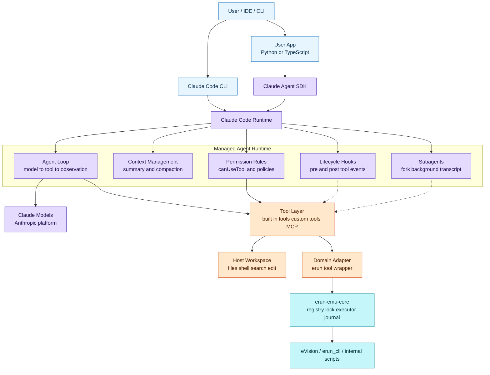
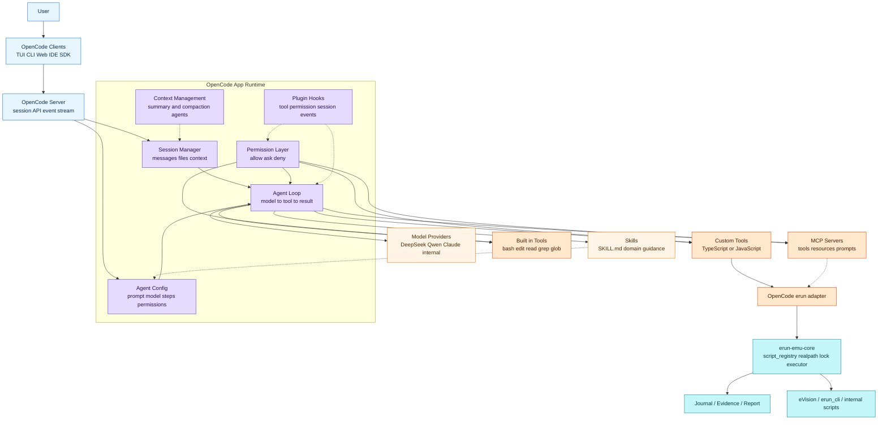

# OpenCode vs Claude Code Agent Framework

本页回答三个问题：

1. OpenCode 本身作为 agent 框架提供了什么能力？
2. OpenCode 和 Claude Code/Claude Agent SDK 的框架差异是什么？
3. 开发 erun/eVision emu agent 时，基于 OpenCode 和基于 Claude Code 开发有什么区别？

## 一句话结论

OpenCode 更像“可配置、多模型、本地优先的 agent 应用/工作台”；Claude Code/Claude Agent SDK 更像“Anthropic 已经打磨好的 agent runtime，可直接把 Claude Code 的 agent loop、工具、上下文管理、hooks 拿来用”。

> [!important] 重要澄清
> OpenCode 不是没有 agent loop、context management 和 hooks。它有内建 agent loop、session/context 压缩、permission、plugin hooks 和 server/SDK。区别在于：OpenCode 的这些能力主要作为 OpenCode 应用/server 的运行时存在；Claude Agent SDK 则更明确地把 Claude Code 背后的 agent loop、tools、context management 包成可嵌入 Python/TypeScript 程序的 SDK runtime。

对当前 erun-emu 项目，OpenCode 更适合作为用户入口和 demo 平台；Claude Code 更适合作为 runtime 设计参考，或者未来作为另一个 adapter 接入同一套 `erun-emu-core`。

```text
OpenCode agent / Claude Code agent / MCP server
        |
        v
erun-emu-core
  - script_registry
  - realpath 校验
  - resource lock
  - executor
  - fixed-format error parser
  - journal/report/evidence
        |
        v
eVision / erun_cli / 内部脚本
```

## 总体框架图

> [!note]
> 下面两张图是从 agent 开发者视角抽象出来的总体框架图，不是源码目录图。重点是看清楚“谁提供通用 agent runtime，谁承载业务安全边界”。

### Claude Code / Claude Agent SDK 总体框架



Claude Code 的关键特征是：通用 agent runtime 被 Claude Code CLI 和 Claude Agent SDK 明确托管并暴露，agent 开发者可以更多复用它的 loop、context、permission、hooks、subagent 和 transcript 能力。对 erun-emu 来说，仍然不应该把硬件安全语义交给 prompt，而应该放到 `erun-emu-core`。

### OpenCode 总体框架



OpenCode 的关键特征是：它把 TUI、server、session、agent 配置、多模型 provider、tools、permission、skills、plugins 组合成一个可配置工作台。它有 agent loop 和 context management，但业务 runtime 的确定性、审计、硬件互斥和脚本白名单仍应由 `erun-emu-core` 承担。

## OpenCode 作为框架提供什么

OpenCode 提供的是一套 agent 框架和用户入口：

| 层 | OpenCode 能力 |
|----|---------------|
| 交互层 | TUI、CLI、Web、IDE、server、SDK |
| 模型层 | 通过 provider/model 配置接不同模型，适合 DeepSeek、Qwen、内部模型等部署 |
| Agent 层 | primary agent、subagent、hidden agent；可配置 prompt、model、temperature、steps、permission、task permission；`steps` 控制 agentic iterations 的最大次数 |
| 工具层 | 内置 `bash/edit/write/read/grep/glob/apply_patch/skill/webfetch/websearch/question` 等工具，也支持自定义 TS/JS tools 和 MCP server |
| 权限层 | `allow/ask/deny`，支持按 agent、bash glob、subagent task 权限配置 |
| Skill 层 | 通过 `SKILL.md` 做按需加载的领域能力说明 |
| Context/session 层 | session 管理、hidden `compaction` agent、hidden `summary` agent、手动 `/compact` 或 `/summarize`、文件引用 `@file` |
| 插件层 | 可通过 plugin hook 观察/扩展 tool、permission、session 等事件，例如 `tool.execute.before/after`、`permission.asked/replied`、`session.compacted` |
| 程序化接入 | OpenCode SDK 是 type-safe JS/TS client，可控制 OpenCode server 和 session |

因此，OpenCode 给的是“用户在里面对话 + agent 配置 + 工具扩展 + 权限 + 多模型”的基础设施。它非常适合让用户在 OpenCode 里自然语言调用 `erun-emu` agent。

## OpenCode 有没有 Agent Loop、Context Management 和 Hooks

答案是：有。

### Agent loop

OpenCode agent 配置里有 `steps`，它控制 agentic iterations 的最大次数；如果不设，agent 会一直迭代到模型选择停止或用户中断。达到 step limit 后，OpenCode 会让 agent 总结已完成工作和剩余任务。

所以 OpenCode 不是 prompt runner。它有完整的“模型输出 -> 工具调用 -> tool result 回填 -> 下一轮模型调用”的循环。

### Context management

OpenCode 至少提供这些 context/session 能力：

- hidden `compaction` agent：长上下文需要压缩时自动运行。
- hidden `summary` agent：自动生成 session summary。
- `/compact` 或 `/summarize`：手动压缩当前 session。
- `@file`：把文件内容加入 conversation context。
- `/sessions`：在 TUI 里恢复或切换 session。
- plugin event：`session.created`、`session.updated`、`session.compacted`、`session.idle` 等。

这说明 OpenCode 有 context management，但它的形态偏产品内建。Claude Agent SDK 则把 “same tools, agent loop, and context management that power Claude Code” 明确作为 SDK 能力暴露给开发者。

### Hooks / plugin system

OpenCode 有 plugin hooks。典型事件包括：

- `tool.execute.before`
- `tool.execute.after`
- `permission.asked`
- `permission.replied`
- `session.created`
- `session.compacted`
- `session.updated`
- `session.idle`
- `file.edited`
- `message.updated`
- `tui.prompt.append`

其中 `tool.execute.before` 可以修改 tool 参数或抛错阻止执行，适合做安全保护、参数归一、审计等扩展。

区别是：OpenCode 是 plugin event/hook 系统；Claude Agent SDK 是 SDK 级 agent lifecycle hooks，可以直接在 SDK query/options 中注册。

## OpenCode Server 是什么

OpenCode server 是一个 headless HTTP server，暴露 OpenAPI endpoint，供 TUI、SDK、IDE、Web 或其它 client 调用。

运行形态：

```text
opencode
  -> 启动 TUI + 内部 server
  -> TUI 是 client

opencode serve
  -> 启动无 TUI 的 HTTP server
  -> 前台运行，直到进程退出
  -> 可以用 systemd/nohup/tmux 等方式托管成 daemon
```

所以它不是传统意义上“安装后自动常驻系统后台”的 daemon。更准确地说：`opencode serve` 是一个前台 headless server 进程；如果需要常驻，可以由外部进程管理器把它 daemon 化。

## Claude Code/Claude Agent SDK 提供什么

Claude Code 有两层：

- Claude Code CLI：成熟的交互式 coding agent。
- Claude Agent SDK：把 Claude Code 的 agent loop、工具、上下文管理作为 Python/TypeScript 库给你嵌入自己的程序。

Claude Code/SDK 更强的部分在于内建 runtime：

- 内置文件、命令、编辑、搜索等工具。
- Agent loop 由 SDK 托管。
- Subagent、fork、background task、独立 transcript。
- Permission rules、`canUseTool`、hooks。
- `PreToolUse`、`PostToolUse`、`Stop`、`SubagentStart`、`SubagentStop`、`PreCompact` 等 hook 点。
- Session state 用 JSONL 持久化。
- 更深的 Claude 模型和 Anthropic 平台绑定。

所以 Claude Code 更像“成熟 agent runtime 产品/SDK”，OpenCode 更像“开放、可配置、多模型 agent 应用/工作台”。二者都有 runtime，只是暴露边界和可编程深度不同。

## 开发 Agent 时的关键区别

| 维度 | 基于 OpenCode | 基于 Claude Code / Agent SDK |
|---|---|---|
| 模型选择 | 多 provider，更适合接 DeepSeek/Qwen/内部模型 | 主要面向 Claude/Anthropic 生态 |
| 开发形态 | 写 agent markdown/config、custom tools、plugins、MCP | 写 subagent/skills/hooks，或用 Agent SDK 写 Python/TS 程序 |
| Runtime 暴露方式 | 有内建 loop/context/hooks，但主要作为 OpenCode 应用/server runtime 暴露 | 明确把 Claude Code loop/context/tools 包成可嵌入 SDK runtime |
| 工具扩展 | `.opencode/tools/*.ts`、plugins、MCP | SDK in-process tools、MCP、hooks、Claude Code tools |
| 权限控制 | permission 配置 + plugin hook 可加强 | permission + hooks 更细，hook 事件更完整 |
| 多 agent | primary/subagent、task permission | subagent、fork、background、transcript、agent teams 更强 |
| 适合场景 | 多模型本地 agent 产品、团队自定义工作台 | Claude 生态内的高质量 agent automation |
| 对 erun-emu | 适合当前 demo 和用户入口 | 适合借鉴 runtime 设计，或以后做 Claude 版 adapter |

## 对 erun-emu 的选型判断

当前继续选 OpenCode 做用户入口，原因很现实：

1. 用户就在 OpenCode 里对话。
2. 公司部署模型可能不是 Claude，而是 DeepSeek V4 Flash 级别或其它内部模型。
3. OpenCode 支持 agent、skill、custom tool、permission、MCP，足够做 demo。
4. 我们已经把安全边界放在 `erun-emu-core + script_registry`，不依赖 OpenCode 自身完全兜底。

但要借鉴 Claude Code 的设计：

- tool 不是函数，而是协议对象。
- 高风险动作必须 permission ask。
- session/journal/evidence 要工程化。
- subagent 只做只读分析，不直接操作板卡。
- skill 是模型可读知识，registry 才是机器执行边界。

## 具体开发差异

### 基于 OpenCode 开发

主要工作是组装和补齐：

- 写 `opencode/agents/erun-emu.md`，定义角色、模型、prompt、permission。
- 写 `skills/erun-opencode-runtime-skill/SKILL.md`，承载 erun/eVision 业务知识。
- 写 custom tools 或 MCP adapter，让 OpenCode 能调用 `erun-emu-core`。
- 通过 permission 配置和 plugin hook 做安全增强。
- 自己实现 journal、report、resource lock、error parser 等业务 runtime。

优点：

- 多模型友好。
- 与用户实际使用环境一致。
- 可以逐步接入内部工具链。

风险：

- 不能假设 OpenCode 已经替你做好所有业务 runtime 治理；它负责通用 agent loop，不负责 erun/eVision 硬件安全语义。
- 对低能力模型要更依赖结构化输出、候选动作和固定模板。

### 基于 Claude Code / Agent SDK 开发

主要工作是嵌入和适配：

- 用 Claude Agent SDK 写 Python/TypeScript agent 程序。
- 用 SDK tool 包装 `erun-emu-core`。
- 利用 SDK 的 permission、hooks、session、subagent 能力。
- 如果使用 Claude Code CLI，则通过 skills/subagents/hooks 做扩展。

优点：

- runtime 完整度更高。
- hooks、session、subagent 能力更成熟。
- Claude 模型与工具调用配合更稳。

风险：

- 更绑定 Claude/Anthropic 生态。
- 如果公司实际部署模型不是 Claude，落地环境可能不匹配。
- 硬件执行安全边界仍然不能只靠 prompt，仍要依赖 `erun-emu-core`。

## 推荐架构

不要把业务能力写死在 OpenCode 或 Claude Code 某一个框架里。推荐把框架当 adapter：

```text
OpenCode adapter
  - agent markdown
  - custom tools
  - permissions

Claude Code adapter
  - skill/subagent/hook
  - SDK tools

MCP adapter
  - server/tool/resource/prompt

All adapters call:
  erun-emu-core
    - script_registry
    - executor
    - resource lock
    - journal
    - report
```

这样今天基于 OpenCode 做，未来要接 Claude Code 或 MCP，也只是换 adapter，不重写业务核心。

## 参考资料

- [OpenCode Agents](https://opencode.ai/docs/agents/)
- [OpenCode Tools](https://opencode.ai/docs/tools/)
- [OpenCode Custom Tools](https://opencode.ai/docs/custom-tools/)
- [OpenCode Skills](https://opencode.ai/docs/skills/)
- [OpenCode Plugins](https://opencode.ai/docs/plugins/)
- [OpenCode SDK](https://opencode.ai/docs/sdk/)
- [Claude Agent SDK Overview](https://code.claude.com/docs/en/agent-sdk/overview)
- [Claude Code Subagents](https://code.claude.com/docs/en/sub-agents)
- [Claude Agent SDK Hooks](https://code.claude.com/docs/en/agent-sdk/hooks)
- [Claude Code Permissions](https://code.claude.com/docs/en/permissions)

## 关联

- [[opencode-agent-platform-patterns]]
- [[tool-permission-runtime-patterns]]
- [[prompt-skill-mcp-patterns]]
- [[erun-emu-agent-application]]
- [[multi-agent-control-plane-patterns]]
